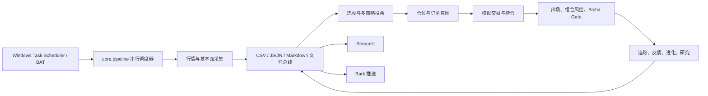

# v8.6 架构全景、风险与演进方案

> 日期：2026-07-14  
> 范围：当前本地工作树（不是已发布的 GitHub 快照）  
> 结论：选择“模块化单体加固 → B-lite 渐进演进”，不做外部框架整体迁移

## 1. 审计边界与证据

本次检查了入口、配置、40 步流水线、数据采集、选股、仓位、模拟交易、组合风控、反馈、回测、Streamlit、Bark、测试与 Git 状态，并实际运行全量测试。

需要先说明一个限制：本地 Git 仓库没有配置 remote，系统也没有 `gh` 命令，因此无法证明当前代码已经存在于 GitHub。仓库只有 1 个初始化提交；当前 v8.6/v8.7 相关代码、测试和大量运行产物仍在未提交工作树中。本文以当前工作树为准，不能当作远端主分支审计结果。

已核实的规模与状态：

- 87 个 Python 文件，约 24,406 行。
- 最大文件包括 `app/pages.py` 1,358 行、`sim_trade.py` 1,013 行、`strategy_feedback.py` 905 行、`position_sizer.py` 861 行。
- `core/pipeline.py` 注册 40 个步骤，其中 31 个每日步骤；仅 5 个步骤失败即中止，仅 2 个步骤配置重试。
- 全量测试：235 passed、2 xfailed；已知 xfail 是策略目标日期未截断未来数据、组合风控单持仓崩溃。
- 最近覆盖率审计记录为总分支覆盖约 25%。
- 三模型协作已按项目规范尝试，但 GPT、DeepSeek、Kimi 三路均缺少环境变量，因此本轮降级为单模型审计。

## 2. 当前架构的本质

这不是微服务，也不是真正的 DAG。它的本质是：

**Windows 定时器驱动的、子进程隔离的、文件产物型模块化单体。**



`core.pipeline` 所谓 DAG 只有注册表和顺序，没有依赖边。每个步骤通过 `subprocess` 独立运行，彼此主要靠固定目录、固定文件名、日期后缀和“取最新文件”交流。这些文件就是事实上的内部 API。

### 2.1 主要模块边界

| 边界 | 代表代码 | 当前职责 |
|---|---|---|
| 调度与配置 | `core/pipeline.py`、`core/config.py` | 步骤注册、Tier、时间表、重试、配置覆盖 |
| 数据接入 | `fetch_*.py`、`data_loader.py`、`data_validator.py` | 行情、历史、指数、ETF、基本面、数据健康 |
| 信号研究 | `strategy.py`、`multi_strategy.py`、`factor_analysis.py` | 因子计算、筛选、投票、权重 |
| 回测验证 | `enhanced_backtest.py`、`walk_forward.py`、`monte_carlo.py` | 收益评估、滚动验证、扰动测试 |
| 风控与订单 | `position_sizer.py`、`exit_advisor.py`、`portfolio_risk.py` | 市场状态、仓位、止损、出场、组合风险 |
| 执行与账本 | `sim_trade.py`、`portfolio_manager.py`、`broker_adapter.py` | 模拟成交、账户、持仓同步、券商格式 |
| 反馈与治理 | `strategy_feedback.py`、`alpha_gate.py`、`evolve_*.py` | 前瞻收益、参数反馈、暂停、进化 |
| 交互输出 | `app/`、`bark_sender/`、各类报告 | 仪表盘、推送、人读报告 |
| 横切能力 | `cost_model.py`、`utils/calendar.py`、`utils/file_io.py` | 成本、交易日、原子写 |

### 2.2 真实数据流

核心链路是：

`stock_YYYYMMDD.csv/history.csv` → `pick_YYYYMMDD.md` → `multi_vote_YYYYMMDD.json` → `daily_orders_YYYYMMDD.json` → `account_state.json/trade_history.csv` → 风控、反馈、报告与推送。

优点是每一步都能人工打开检查。缺点是消费者经常用 `glob + reverse sort` 找“最新文件”，没有统一声明：这份文件属于哪个交易日、哪次运行、使用哪版配置、由哪批输入生成。

## 3. 做得好的地方

1. **与实际规模匹配。** 单机、个人、低频、1200 元资金不需要分布式系统；本地文件和子进程的运维成本很低。
2. **可解释、可人工恢复。** CSV/JSON/Markdown 都能直接检查，单步骤也能手工重跑。
3. **故障隔离尚可。** 脚本用独立进程运行，一个模块的全局变量不容易污染其他模块。
4. **资金现实约束考虑较真。** 最低佣金、印花税、滑点、100 股约束、小资金集中都已进入成本与仓位逻辑。
5. **已有安全装置。** Alpha Gate、数据校验、自检自愈、风险配置归档、部分原子写、Tier gate 均有价值。
6. **测试已形成基础。** 235 个通过用例覆盖了成本、交易日、成交、配置、回测、风控和多轮回归问题。
7. **包化已有正确开端。** `core/`、`app/`、`bark_sender/`、`utils/` 说明项目已经开始从“大量脚本”向模块化单体演进。

## 4. 最危险的结构风险

### 4.1 代码没有可靠版本基线

只有一个初始化提交、无远端，而运行数据和源码混在同一个工作树。当前系统即使今天做出一个订单，也很难严格回答“是哪一版代码、哪份配置、哪批数据生成的”。这比是否使用某个框架更危险。

### 4.2 文件名与顺序是隐形接口

“取最新文件”会让昨天产物、部分写入产物或不同运行的产物混在一起。`position_sizer` 甚至有从策略报告、再到最新全市场 CSV 的多级回退；回退虽然提高了“总有输出”的概率，却可能把“没有有效选股信号”误解释成“从全市场随便取前几条继续下单”。资金链路应当 fail closed，而不是尽量凑出订单。

### 4.3 时间语义没有成为一等公民

当前 `target_date`、文件名日期、系统当前日期、历史数据最大日期并未由统一 `RunContext` 约束。已有 xfail 已经证明未来数据泄露能进入策略筛选。回测、实时信号、出场和反馈如果对“截至哪一天可见”理解不同，结果会虚高或错单。

### 4.4 状态存在多个事实源

真实交易、模拟账户、组合状态、订单、风险配置、进化状态分别保存在多个 CSV/JSON 中。它们之间靠每日同步脚本最终一致，缺少事务和唯一状态所有者。一旦中途失败，可能出现“账户卖了、组合状态没卖”“风险参数已改、报告没写”等半完成状态。

### 4.5 调度器会把部分失败包装成成功

40 步里只有 5 步是 fatal。其余步骤失败后流水线继续，最终仍打印 `Pipeline complete`。没有步骤级运行账本、输入输出校验、依赖传播或断点续跑。因此“进程返回 0”不等于“整条交易决策链完整有效”。

### 4.6 Alpha Gate 的作用边界过大

Gate 在整个流水线开始前直接返回。暂停买入本来是正确的，但当前设计也可能顺带停止行情刷新、已有持仓出场、风险检查、账本更新与通知。正确边界应是“禁止新风险暴露”，而不是“关闭整个控制系统”。

### 4.7 配置已集中，但仍有分裂

配置文件、代码默认值、导入时固化的模块常量、进化状态和历史源码常量共同决定行为。`reload_tier()` 的注释也承认部分 `ENABLE_*` 标志在 import 时已经固化。版本号仍是 8.6，但多个注释和测试已经称 v8.7。缺少每次运行的不可变配置快照。

### 4.8 研究、决策和落盘混在同一函数

大量脚本同时读取文件、做计算、写报告、打印日志并处理降级。UI 又直接 import 业务脚本和修改生产状态。这会让纯计算难以测试，也让 Streamlit 重跑语义意外触发状态读写。

### 4.9 异常处理偏“吞错继续”

项目里存在大量宽泛 `except Exception`。对展示层可以降级，但交易日期、数据模式、仓位和账户状态异常不应静默回退。当前错误策略没有按“资金安全级别”分类。

### 4.10 进化器和生产策略边界不够硬

每日状态、A/B 实验和竞技进化都围绕相同参数工作；历史设计中周度进化甚至能修改回测源码常量。研究结果应先进入候选配置，经过独立验证和人工批准，再晋升生产，不能让研究流程直接改变生产行为。

## 5. 三种架构方案比较

评分 1～5，越高越适合当前项目；“迁移安全性”高表示改造风险低。

| 方案 | 可靠性 | 迁移安全性 | 个人维护成本 | 可测试性 | 对真实收益的相关价值 | 结论 |
|---|---:|---:|---:|---:|---:|---|
| A. 加固文件型模块化单体 | 4.2 | 4.8 | 5.0 | 4.0 | 4.5 | 立即采用 |
| B. 包内领域服务 + 真 DAG + SQLite/Parquet | 4.8 | 2.8 | 3.5 | 5.0 | 4.2 | 渐进采用，不重写 |
| C. 外部框架整体迁移 | 3.2 | 1.5 | 2.0 | 4.0 | 2.0 | 当前不采用 |

### 5.1 方案 A：继续文件型模块化单体

最适合当下。保留脚本入口、BAT、任务计划、报告和文件兼容性，只补充运行上下文、产物清单、模式校验、明确依赖、失败等级和状态日志。

它的局限是：只靠文件无法很好解决账户状态的事务一致性；随着状态和策略继续增加，隐式耦合还会回来。所以 A 应当是稳定底座，不是永久停止演进。

### 5.2 方案 B：领域服务 + 轻量真 DAG + 混合存储

长期最合理，但应拆成小步。推荐的目标不是企业级平台，而是一个可安装的 Python 模块化单体：

```text
quant/
  domain/          Signal, OrderIntent, Fill, Position, RiskDecision
  application/     每日选股、生成订单、模拟成交、风险评估用例
  data/            行情与基本面接口
  research/        回测、walk-forward、实验晋升
  infrastructure/  CSV/JSON/SQLite/Parquet/Bark 适配器
  orchestration/   TaskSpec、依赖、RunContext、运行账本
  ui/              只调用 application，不直接写状态文件
```

存储建议采用混合方案：

- SQLite：运行账本、订单、成交、持仓、配置版本、状态事件。
- Parquet：大体量历史行情和因子表。
- JSON/Markdown：继续作为兼容接口和人读输出。

不建议第一天就迁走全部 CSV/JSON。先加 Repository 接口和双写/兼容适配器，再逐项切换。

### 5.3 方案 C：迁移外部框架

- **Qlib**：适合因子研究、数据集、模型实验和实验记录，可作为隔离的研究沙箱；它不适合直接替代当前 A 股采集、Bark、Streamlit、新手保护和本地模拟账本全链路。
- **Backtrader**：适合统一事件驱动回测与经纪商抽象，但当前系统是日频批处理、文件产物和自定义 A 股成本规则；整体迁移会先花大量时间重建已有能力，不能自动带来 alpha。
- **Prefect 一类编排器**：能提供重试、缓存、可视化状态和任务依赖，但它只解决调度，不解决交易日期、数据模式、状态唯一来源和策略正确性。对单机 40 步日频任务，先写好内部轻量 DAG 更便宜。

外部框架可以在明确痛点出现后局部引入，但不应成为当前架构重写理由。

## 6. 推荐方案：A → B-lite，而不是重写

核心原则：**先封住会产生错单的缝，再整理代码；先建立可复现性，再谈框架。**

### 阶段 0：建立可信基线（立即）

1. 配置 Git 远端，提交一份只含源码、测试、配置模板的干净基线；运行产物不进入主源码提交。
2. 明确当前到底是 v8.6 还是 v8.7，统一版本、注释、报告与测试命名。
3. 修复两个 xfail：策略按 `target_date` 截断历史数据；组合风控支持 0/1 个持仓。
4. 为每次流水线生成 `run_id`、`trading_date`、代码提交号、配置哈希和输入数据截止日。

### 阶段 1：加固现有流水线（优先级最高）

1. 引入 `RunContext`，所有资金相关步骤必须显式接收同一个 `trading_date/as_of`。
2. 每步声明 `depends_on / inputs / outputs / criticality`，调度器按依赖执行，不再靠字典顺序冒充 DAG。
3. 生成 `run_manifest.json`：记录每个产物的模式版本、行数、哈希、生产步骤和时间范围。
4. 资金路径取消“找不到就取最新/随便回退”：数据或信号缺失时生成零买入订单，并明确告警。
5. 失败分级：数据、策略、仓位、账户状态 fail closed；报告、研究、心理、推送展示可 fail open。
6. Alpha Gate 只阻断新买入，仍允许行情刷新、卖出、风险检查、账本、健康检查和告警运行。
7. 每次运行保存不可变配置快照，杜绝模块导入时固化值和中途 reload 混用。

### 阶段 2：渐进包化与状态收口

1. 从 `cost_model`、交易日、订单、成交、持仓、风险决策开始定义纯领域对象。
2. 把脚本拆成 `load → pure calculate → persist → present`，保留原 CLI 作为薄适配器。
3. SQLite 先接管运行账本、订单/成交/持仓；Parquet 再接管历史行情。保留旧文件双写，直到所有消费者迁完。
4. Streamlit 只调用 application service，不再直接 import 大脚本或改生产文件。
5. 研究配置与生产配置分库；实验必须经过回测、walk-forward、成本压力测试和人工批准才能晋升。

### 阶段 3：按需引入外部能力

只有满足以下条件才引入框架：

- 因子/机器学习实验明显增多，再把 Qlib 作为研究适配器。
- 需要统一事件级回测/撮合，再评估 Backtrader 适配器。
- 需要跨机器、并发、远程监控或复杂补跑，再评估 Prefect。

这些框架都不应直接拥有生产账户状态，也不应改变现有买卖语义。

## 7. 迁移时必须保持不变的接口

为避免架构改造改变交易结果，以下内容必须先冻结并做契约测试：

1. `daily_pipeline.py`、`strategy.py`、`position_sizer.py`、`sim_trade.py` 等 CLI 名称、参数和退出码。
2. Task Scheduler/BAT 入口与 Streamlit、Bark 的用户操作方式。
3. `core.config.get()` 的点分路径语义，以及两个版本号单一事实源。
4. 关键产物的兼容读写：`stock_YYYYMMDD.csv`、`history.csv`、`pick_*.md`、`multi_vote_*.json`、`daily_orders_*.json/md`、`account_state.json`、`trade_history.csv`。
5. A 股规则：100 股单位、涨跌停、T+1 相关假设、最低佣金、印花税、滑点分档、小资金模式。
6. 买入、卖出、止损、止盈、死叉、持有期和市场状态的现有语义；架构迁移不能偷偷调参。
7. 当前测试夹具和 235 个通过用例；每迁一个模块，旧接口与新接口要跑同一组黄金样例并得到一致结果。

## 8. 最终判断

这个项目目前最大的优点是“透明、能跑、贴合个人使用”，最大的风险是“结果不可严格复现，文件与日期契约过于隐式”。

最优路线不是换框架，而是把现有系统提升成一个**有运行上下文、有产物模式、有唯一状态源、会按资金风险安全失败的模块化单体**。完成这一步后，再把状态和大数据逐步迁到 SQLite/Parquet。外部框架最多作为研究或调度适配器，不应成为系统中心。

